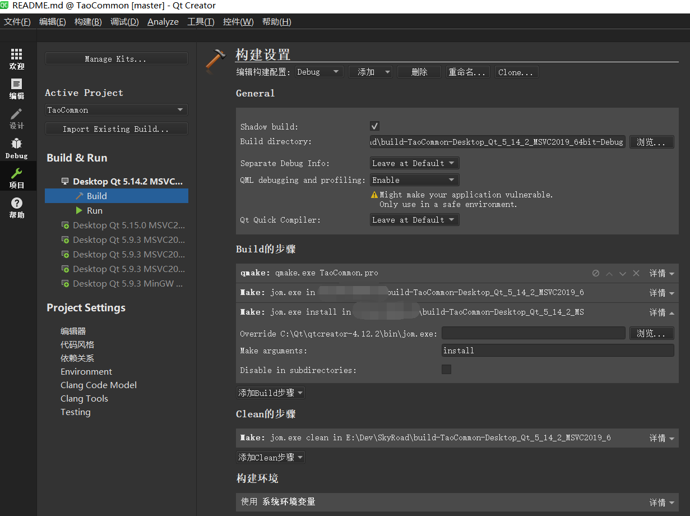

# TaoCommon

## 简介

收集一些常用的Qt后端代码，以便以后复用。

必须是经过实际项目验证过的。

[github原始仓库https://github.com/jaredtao/TaoCommon](https://github.com/jaredtao/TaoCommon)

[gitee镜像仓库https://gitee.com/jaredtao/TaoCommon](https://gitee.com/jaredtao/TaoCommon)

## CI

| [Windows][win-link]| [Ubuntu][ubuntu-link]|[MacOS][macos-link]|[Android][android-link]|[IOS][ios-link]|
|---------------|---------------|-----------------|-----------------|----------------|
| ![win-badge]  | ![ubuntu-badge]      | ![macos-badge] |![android-badge]   |![ios-badge]   |


[win-link]: https://github.com/JaredTao/TaoCommon/actions?query=workflow%3AWindows "WindowsAction"
[win-badge]: https://github.com/JaredTao/TaoCommon/workflows/Windows/badge.svg  "Windows"

[ubuntu-link]: https://github.com/JaredTao/TaoCommon/actions?query=workflow%3AUbuntu "UbuntuAction"
[ubuntu-badge]: https://github.com/JaredTao/TaoCommon/workflows/Ubuntu/badge.svg "Ubuntu"

[macos-link]: https://github.com/JaredTao/TaoCommon/actions?query=workflow%3AMacOS "MacOSAction"
[macos-badge]: https://github.com/JaredTao/TaoCommon/workflows/MacOS/badge.svg "MacOS"

[android-link]: https://github.com/JaredTao/TaoCommon/actions?query=workflow%3AAndroid "AndroidAction"
[android-badge]: https://github.com/JaredTao/TaoCommon/workflows/Android/badge.svg "Android"

[ios-link]: https://github.com/JaredTao/TaoCommon/actions?query=workflow%3AIOS "IOSAction"
[ios-badge]: https://github.com/JaredTao/TaoCommon/workflows/IOS/badge.svg "IOS"

## 内容

按文件夹分类

## Logger

  日志模板，来自[TaoLogger项目](https://github.com/jaredtao/taologger)

## Thread

  Qt多线程模板，来自[TaoThread项目](https://github.com/jaredtao/TaoThread)

  包括对Qt的Worker-Controller多线程模型的封装。

## Common

  一些通用的代码段。

  |文件名|功能|
  | ---- | -------------------------------- |
  |FileReadWrite.h|文件读写、Json读写|
  |ObjectMap.h|基础对象存储器;优先级对象存储器|
  |Singleton.hpp|单例模板|
  |Subject.hpp|观察者模板|
  |Common.h|QString 支持std::map; <br/>C++11 的 enum 和 int互转; <br/> 计算md5; <br/> 计算percent字符串;<br/> 简易socket数据封包、拆包|

***

## 使用方式

### 用法(1) -- 使用源码

直接在你的项目中包含TaoCommon.pri文件，

include(TaoCommon/src/TaoCommon/TaoCommon.pri)

你可以将"TaoCommon/src/TaoCommon"路径中的最内层的TaoCommon文件夹拷贝到任意位置，并

在你的项目中添加对应位置的TaoCommon.pri, 使用的地方包含头文件即可。

可以参考示例 demo/CommonWithSource

### 用法(2) -- 作为Qt模块安装

TaoCommon本身是一个Qt模块，可以通过make install的方式，直接安装进QTDIR.

(Qt模块需要安装perl)

只需要执行以下命令：

```shell
qmake
make
make install
```

也可以通过QtCreator执行安装:

打开TaoCommon项目，在 QtCreator的 "项目->Build 步骤" 中，添加一个 make install步骤进行安装。



安装完成后，在你的项目pro文件中，增加 QT += TaoCommon即可导入模块,使用的地方包含头文件即可。

注意编译TaoCommon所使用的Qt版本，要和你的项目使用的版本相同，否则会找不到模块。

可以参考示例 demo/CommonWithModule

发布程序时需要带上QTDIR/bin/TaoCommon.dll

### 两种用法的对比

以源码的方式使用，优点是方便，缺点是会增加编译时间。

以Qt模块的方式使用，优点是不用每次都编译，缺点是要注意Qt版本一致性，且发布时要带上dll。

## 联系作者

作者：武威的涛哥

欢迎联系我，乐于提供技术咨询服务，可洽谈技术支持、商业合作。

邮箱:  jared2020@163.com            

微信:  xsd2410421 

QQ: 759378563


*** 
## 关注作者动态

欢迎关注涛哥的微信公众号： Qt进阶之路

不定期分享Qt相关的高质量教程


*****
## 寻找同道中人

欢迎加入涛哥的QQ群: Qt进阶之路 

此群是高质量群，Qt界大佬众多，不灌水闲聊，日常交流技术、分享书籍、帮助解决实际问题。

1群：734623697(已满)

2群：342341405


******

## 赞助


 觉得分享的内容还不错, 就请作者喝杯奶茶吧~~


## 赞助列表

感谢以下网友的赞助与支持(排名不分先后)：

hxhlb (花心胡萝卜工作室)

咸鱼猴

Qt侠-刘典武

一去、二三里

大樹

丝绸-郑天佐

寒山-居士

小风电子

Qt君

海盗船

雨田哥

游龙

Rj

重庆-胡某某

Ivy

孙十一少

田宇

power

敢敢

扣脚翁

白菜豆腐

甜不辣

Mr.Hu

秾芳教主

焖哥

蓝色幻想

Martin Zuo

windsmoon

小手冰凉

永远=没有终点

我是王大狗

米粒旅行